# Практикум 7. Візуалізація даних. Бібліотеки візуалізації

---

## Налаштування робочого середовища для работи з візуальніми інструментами

### Pycharm

1. Створюємо віртуальне середовище та профіль в IDE. 
 
- [Cкрипт для підготовки](https://github.com/wellic/ssu_2023_pbd/blob/master/utils/sh/lab7/00_setup_venv.sh)
- налаштування IDE

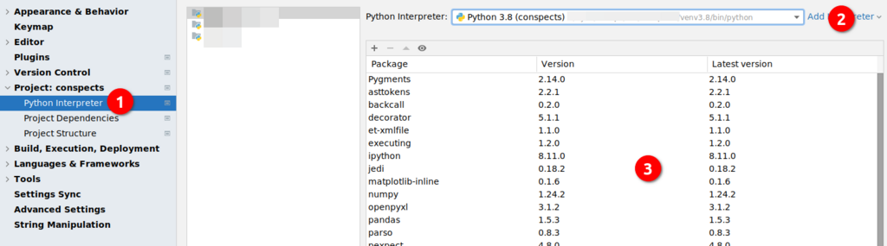)

2. перевіряємо

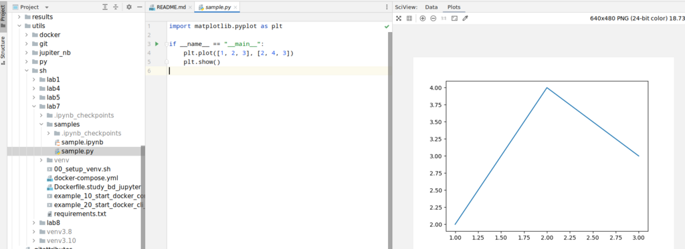)

### Docker: Juyiter

1. Створюємо контейнер за допомогою скрипта:
   [Cкрипт](https://github.com/wellic/ssu_2023_pbd/blob/master/utils/sh/lab7/example_10_start_docker_compose_study_jupyter.sh)

2. перевіряємо

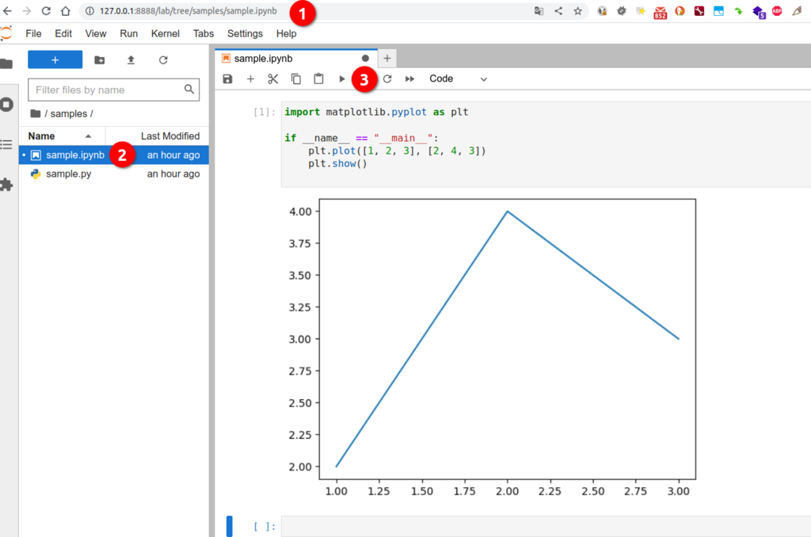)

## Побудова графіків функцій за допомогою Matplotlib

Python надає одну з найпопулярніших бібліотек для побудови графіків під назвою Matplotlib. Це кросплатформовий проект із відкритим вихідним кодом для створення 2D-графіків на основі даних у масиві. Зазвичай він використовується для візуалізації даних та представлений у вигляді різних графіків.

Matplotlib спочатку задуманий Джоном Д. Хантером у 2003 році.

Перш ніж розпочати роботу з бібліотекою matplotlib, нам необхідно встановити її в нашому середовищі Python.

### Встановлення Matplotlib

Введіть наступну команду у своєму терміналі та натисніть клавішу ENTER.

```shell
pip install matplotlib
```

Наведена вище команда встановить бібліотеку matplotlib та її пакет залежностей в операційній системі Windows. Розберемося як побудувати графік функції на Python за допомогою Matplotlib.

### Базова концепція Matplotlib

Графік складається із наступних частин. Давайте розберемося із цими частинами.

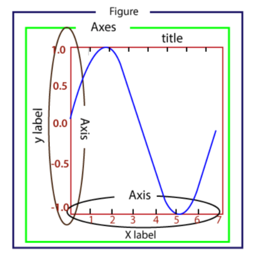

- Figure: це ціла фігура, яка може містити одну або декілька осей (графіків). Ми можемо думати про figure як про полотно, на якому зберігаються сюжети.

- Axes: фігура може містити кілька осей. Він складається з двох або трьох (у разі 3D) об'єктів Axis. Кожна вісь складається з заголовка, x-мітки та y-мітки.

- Axis: осі – це кількість об'єктів, схожих на лінії, які відповідають за межі графіка.

- Artist: це все, що ми бачимо на графіку, наприклад текстові об'єкти, об'єкти Line2D та об'єкти колекцій. Прив'язані до Axes.

### Введення в пакет pyplot

Matplotlib надає пакет pyplot, який використовується для побудови графіка даних. Matplotlib.pyplot – це набір функцій командного стилю, які змушують matplotlib працювати як MATLAB. Пакет pyplot містить безліч функцій, які використовуються для створення фігури, створення її області побудови, доповнення графіка мітками, проведення деяких ліній в області побудови і т.д.

Ми можемо швидко побудувати графік за допомогою pyplot. Погляньмо на наступний приклад.

### Базовий приклад побудови графіка

Програма для створення базового прикладу простого графіка:

```python
from matplotlib import pyplot as plt

# ploting our canvas   
plt.plot([1, 2, 3], [4, 5, 1])
# display the graph   
plt.show()   
```

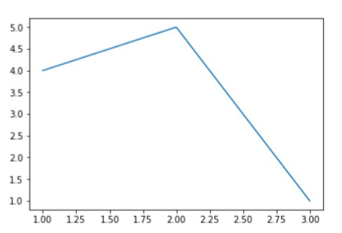

### Побудова графіків різного типу

Ми можемо побудувати різні графіки, використовуючи модуль pyplot.

#### 1. Лінійний графік

Лінійний графік використовується для відображення інформації у вигляді ряду ліній. Його легко будувати.

```python

from matplotlib import pyplot as plt

x = [1, 2, 3]
y = [10, 11, 12]

plt.plot(x, y)

plt.title("Line graph")
plt.ylabel('Y axis')
plt.xlabel('X axis')
plt.show()   
```

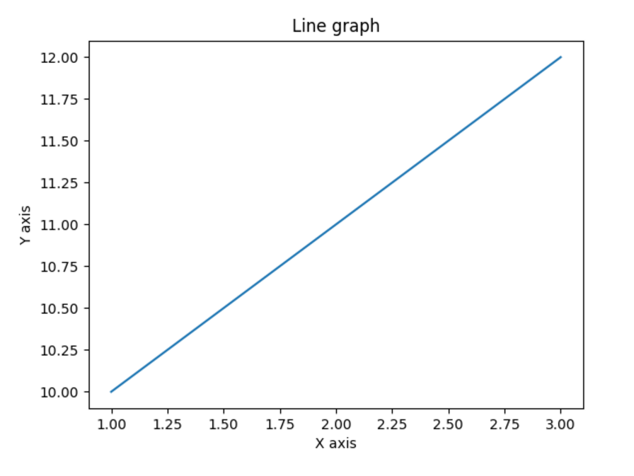

Лінія може бути змінена за допомогою різноманітних функцій. Це робить графік привабливішим. Нижче наведено приклад.

```python

from matplotlib import pyplot as plt
from matplotlib import style

style.use('ggplot')
x = [10, 12, 13]
y = [8, 16, 6]
x2 = [8, 15, 11]
y2 = [6, 15, 7]
plt.plot(x, y, 'b', label='line one', linewidth=5)
plt.plot(x2, y2, 'r', label='line two', linewidth=5)
plt.title('Epic Info')
fig = plt.figure()
plt.ylabel('Y axis')
plt.xlabel('X axis')

plt.show() 
```

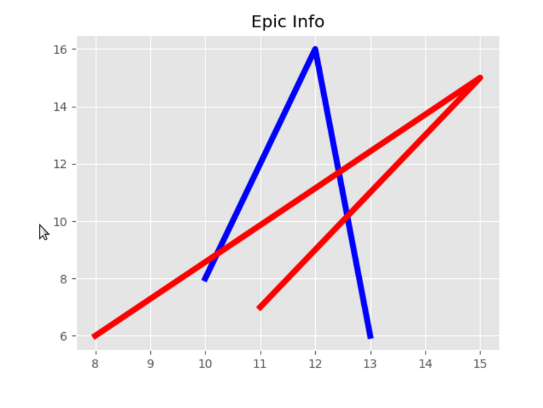

#### 2. Стовпчаста діаграма

Одна з найбільш поширених діаграм, яка використовується для представлення даних, пов'язаних із категоріальними змінними. Функція bar() приймає три аргументи – категоріальні змінні, значення та колір.

```python
from matplotlib import pyplot as plt

Names = ['Arun', 'James', 'Ricky', 'Patrick']
Marks = [51, 87, 45, 67]
plt.bar(Names, Marks, color='blue')
plt.title('Result')
plt.xlabel('Names')
plt.ylabel('Marks')
plt.show()   
```

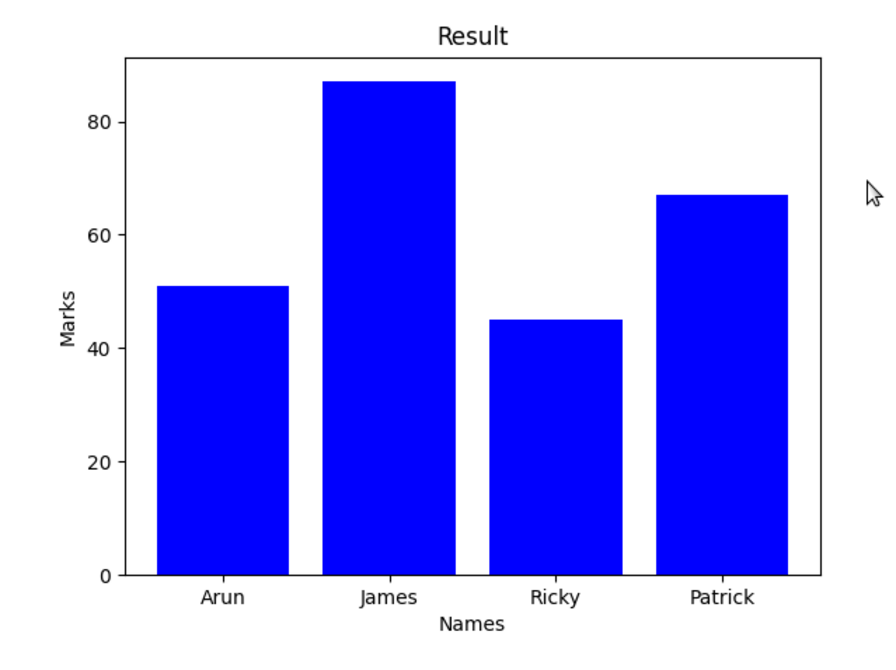

#### 3. Кругова діаграма

Діаграма – це круговий графік, який поділено на частини чи сегменти. Він використовується для представлення відсоткових або пропорційних даних, де кожен шматок пирога представляє певну категорію. Давайте розберемося в наведеному нижче прикладі.

```python
from matplotlib import pyplot as plt

# Pie chart, where the slices will be ordered and plotted counter-clockwise:   
Aus_Players = 'Smith', 'Finch', 'Warner', 'Lumberchane'
Runs = [42, 32, 18, 24]
explode = (0.1, 0, 0, 0)  # it "explode" the 1st slice    

fig1, ax1 = plt.subplots()
ax1.pie(Runs, explode=explode, labels=Aus_Players, autopct='%1.1f%%',
        shadow=True, startangle=90)
ax1.axis('equal')  # Equal aspect ratio ensures that pie is drawn as a circle.   

plt.show()
```

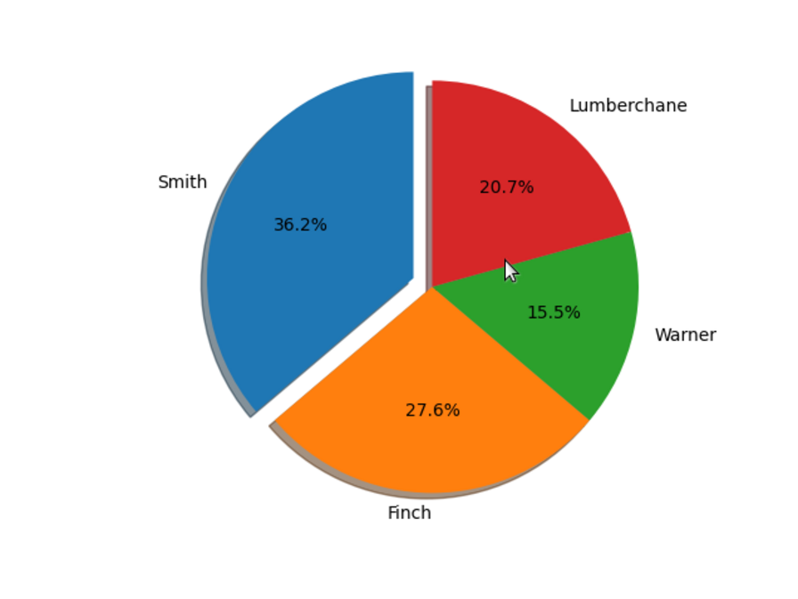

#### 4. Гістограма

Гістограма та стовпчаста діаграма дуже схожі, але є невелика різниця. Гістограма використовується для представлення розподілу, а стовпчаста діаграма використовується для порівняння різних об'єктів. Гістограма зазвичай використовується для побудови графіка частоти ряду значень, порівняно з набором діапазонів значень.

У наступному прикладі ми взяли дані про різні відсотки балів учня та побудували гістограму в залежності від кількості учнів. Давайте розберемося у такому прикладі.

```python
from matplotlib import pyplot as plt

percentage = [97, 54, 45, 10, 20, 10, 30, 97, 50, 71, 40, 49, 40, 74, 95, 80, 65, 82, 70, 65, 55,
    70, 75, 60, 52, 44, 43, 42, 45]
number_of_student = [0, 10, 20, 30, 40, 50, 60, 70, 80, 90, 100]
plt.hist(percentage, number_of_student, histtype='bar', rwidth=0.8)
plt.xlabel('percentage')
plt.ylabel('Number of people')
plt.title('Histogram')
plt.show()   
```

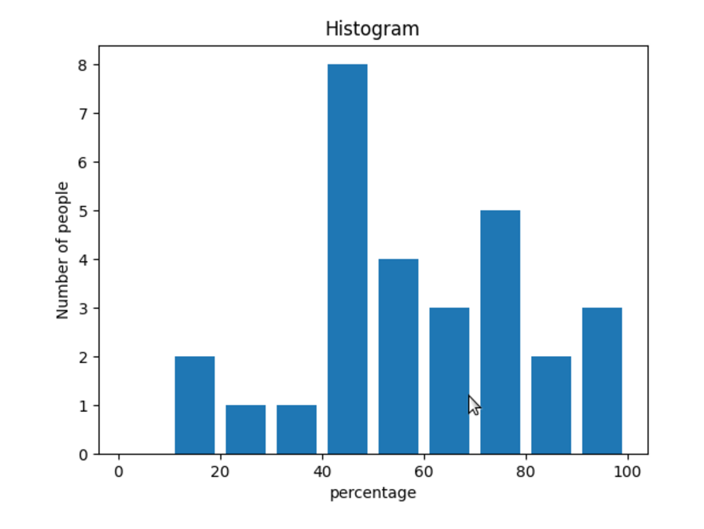

Розберемося ще одному прикладі.

Приклад – 2:

```python
from matplotlib import pyplot as plt
# Importing Numpy Library   
import numpy as np

plt.style.use('fivethirtyeight')

mu = 50
sigma = 7
x = np.random.normal(mu, sigma, size=200)
fig, ax = plt.subplots()

ax.hist(x, 20)
ax.set_title('Historgram')
ax.set_xlabel('bin range')
ax.set_ylabel('frequency')

fig.tight_layout()
plt.show()   
```

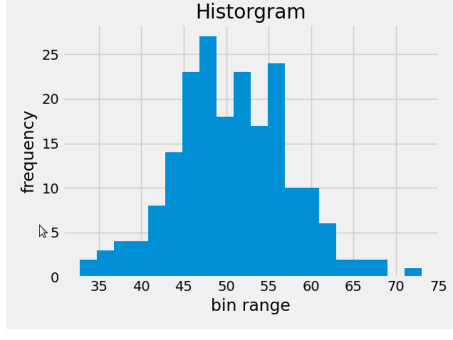

### 5. Точкова діаграма

Ця діаграма використовується для порівняння змінної по відношенню до інших змінних. Вона визначається як вплив однієї змінної іншу. Дані представлені як набору точок.

```python
from matplotlib import pyplot as plt
from matplotlib import style

style.use('ggplot')

x = [4, 8, 12]
y = [19, 11, 7]

x2 = [7, 10, 12]
y2 = [8, 18, 24]

plt.scatter(x, y)

plt.scatter(x2, y2, color='g')

plt.title('Epic Info')
plt.ylabel('Y axis')
plt.xlabel('X axis')

plt.show()   
```


Приклад – 2:

```python
import matplotlib.pyplot as plt

a = [2, 2.5, 3, 3.5, 4.5, 4.7, 5.0]
b = [7.5, 8, 8.5, 9, 9.5, 10, 10.5]

a1 = [9, 8.5, 9, 9.5, 10, 10.5, 12]
b1 = [3, 3.5, 4.7, 4, 4.5, 5, 5.2]
plt.scatter(a, b, label='high income low saving', color='b')
plt.scatter(a1, b1, label='low income high savings', color='g')
plt.xlabel('saving*100')
plt.ylabel('income*1000')
plt.title('Scatter Plot')
plt.legend()
plt.show()   
```

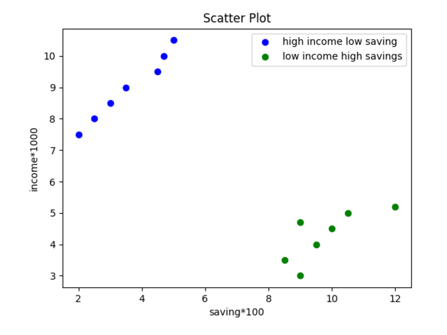

На цьому посібнику ми трохи обговорили всі основні типи графіків, які використовуються під час візуалізації даних.
Щоб дізнатися більше про графік, [відвідайте наш підручник з matplotlib](https://matplotlib.org/stable/gallery/index.html).

---

### Домашня робота

Оформити свої дата фрейми і додати до них графіки

---

# [Література та посилання](links.md)

---

# [На головну сторінку ...](../README.md)
