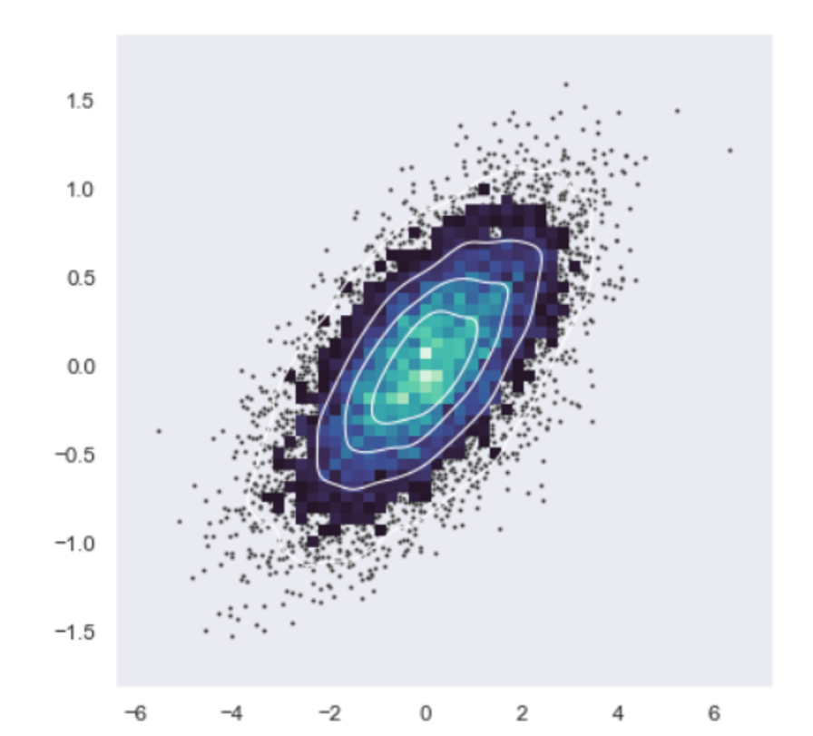
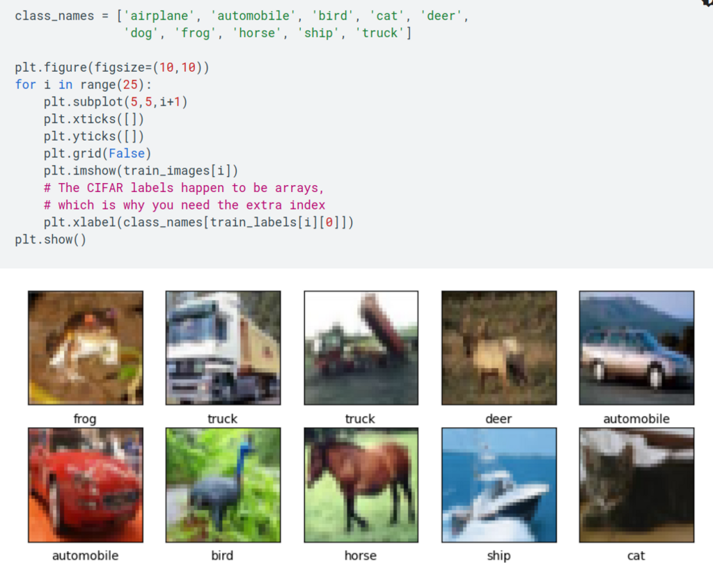

# Лекція 8. Методи та задачі для BigData (BD), DataScience (DS), Artificial Inelegance (AI)

---

## Що таке Data Science, Bigdata, AI

### Data Science (DS)

Data Science - це наука, яка вивчає різні задачі, пов'язані з обробкою, аналізом та використанням даних про те, як ефективно аналізувати та інтерпретувати дані, використовуючи статистичні методи та інструменти.

Data Science включає в себе багато інструментів та технологій, таких як статистика, аналіз даних, машинне навчання, глибинне навчання, обробка природньої мови та багато інших. Нейронні мережі можуть бути використані в Data Science, як частина складних моделей машинного навчання для розв'язання складних завдань, таких як обробка великих обсягів даних, класифікація зображень, розпізнавання мови та багато інших. Це досягається за допомогою нейронних мереж.

### Big Data (BD)

Big Data - це технологія та методи, які використовуються для збору, зберігання та обробки великих об'ємів даних, які неможливо обробити традиційними методами.

Великі дані включають в себе структуровані та неструктуровані дані, які надходять з різних джерел, таких як веб-сторінки, соціальні мережі, сенсори, транзакційні бази даних та інші.

### Artificial Intelligence (AI)

Artificial Intelligence (AI) - (штучний інтедлект) - це наука про розробку та застосування комп'ютерних систем, які здатні розуміти, вивчати та вирішувати завдання, які зазвичай вимагають інтелекту людини.

Системи штучного інтелекту включають в себе методи машинного навчання, нейронні мережі, обробку природної мови, комп'ютерне бачення та інші.

Застосуванням AI є, наприклад, розпізнавання голосу, машинний переклад, автономні автомобілі, рекомендаційні системи та багато іншого.

### Приклади задач, які розв'язує Data Science

1. Прогнозування попиту: створення моделі, яка може прогнозувати попит на продукти або послуги на основі історичних даних.

2. Рекомендації товарів: створення системи рекомендацій для користувачів на основі їх історії покупок та аналізу даних.

3. Аналіз ефективності реклами: вивчення даних про рекламні кампанії та визначення того, які кампанії були найбільш ефективними.

4. Класифікація текстів: створення моделі, яка може автоматично класифікувати текстові дані за певними категоріями, наприклад, статті новин або соціальні медіа.

5. Детекція шахрайства: створення моделі, яка може виявляти ознаки шахрайства на основі фінансових даних та транзакцій.

6. Аналіз відгуків клієнтів: вивчення відгуків клієнтів та визначення їх настроїв та схильностей.

7. Аналіз медичних даних: аналіз медичних даних для виявлення патологій, прогнозування ризику захворювання та покращення діагностики.

8. Прогнозування цін на нерухомість: створення моделі, яка може прогнозувати ціни на нерухомість на основі різноманітних факторів, таких як місцезнаходження, розмір та стан будинку.

## Теоретичне основи Data Science

### Термінологія Data Science

1. Нейронні мережі є одним із ключових інструментів машинного навчання, який використовується в Data Science для розробки моделей прогнозування, класифікації, розпізнавання образів та багатьох інших задач. Нейронні мережі та Data Science це взаємопов'язані поняття, тому що використання нейронних мереж в Data Science може допомогти вирішувати більш складні задачі та досягати кращих результатів.

2. Класифікація: розподіл даних на кілька класів, таких як розпізнавання зображень, класифікація текстів та інших об'єктів.

3. Кластеризація: групування даних на основі подібності, що може бути корисно для виявлення закономірностей та групування користувачів.

4. Регресійний аналіз: вивчення залежностей між змінними та прогнозування результатів на основі цих залежностей.

5. Виявлення аномалій: виявлення незвичайних паттернів або даних, які відрізняються від типових паттернів.

6. Аналіз текстів: виявлення ключових слів, сутностей, категорій або сенсорів в текстових даних.

7. Рекомендації: створення персоналізованих рекомендацій на основі історії користувача та аналізу даних.

8. Візуалізація даних: створення графіків, діаграм, карти та інших візуальних елементів, що допомагають уявити та зрозуміти дані.

9. Обробка природних мов: аналіз та обробка мови на основі натуральної мови, яка може використовуватися для автоматичного перекладу, розпізнавання голосу та інших задач.

### Основні задачі DS

Основні задачі, які вивчає Data Science, включають:

1. Exploratory Data Analysis (EDA) - це дослідницький аналіз даних, мета якого полягає в зрозумінні характеристик даних та виявленні корисної інформації. Приклади: виявлення закономірностей в даних, залежності між різними змінними, виявлення викидів та аномалій.

2. Класифікація та регресія - задачі машинного навчання, які полягають у побудові моделей, які можуть передбачати відповіді на основі вхідних даних. Приклади: класифікація зображень, розпізнавання мовлення, передбачення цін на нерухомість.

3. Кластеризація - задача машинного навчання, яка полягає у групуванні об'єктів в класи на основі подібності. Приклади: сегментація клієнтів, групування новин за темою, аналіз зображень для знаходження подібних об'єктів.

4. Обробка природних мов (NLP)- задача машинного навчання, яка пов'язана з обробкою та аналізом природних мов, зокрема мовлення. Приклади: розпізнавання мовлення, переклад мовлення з однієї мови на іншу, генерація тексту.

5. Аналіз текстів - задача машинного навчання, яка полягає в обробці та аналізі текстових даних, зокрема виявленні тем, сутностей, емоцій тощо. Приклади: аналіз відгуків користувачів на товари, класифікація новин за темою, виявлення негативних коментарів.

## Інструментрій DS

### Інструменти Python для DS

Python є дуже популярним інструментом в області Data Science.

Ці інструменти та бібліотеки є основою для багатьох проектів Data Science, існують також інші інструменти та бібліотеки, які можуть бути корисними в інших конкретних випадках.

Нижче наведені найбільш популярні бібліотеки та інструменти Python для Data Science.

##### [NumPy](https://numpy.org/)

Бібліотека для роботи з числовими даними, яка надає підтримку для масивів та матриць, а також математичних операцій над ними.

##### [Pandas](https://pandas.pydata.org/)

Бібліотека для роботи з даними у вигляді таблиць, яка надає зручний інтерфейс для завантаження, обробки та аналізу даних.

##### [Matplotlib](https://matplotlib.org/)

Бібліотека для візуалізації даних у вигляді графіків, діаграм та інших типів візуальних елементів.

##### [Seaborn](https://seaborn.pydata.org/)

Бібліотека для візуалізації статистичних даних, яка надає інструменти для створення складних графіків, таких як графіки залежності між різними змінними.

##### [Jupyter Notebook](https://jupyter.org/)

Інтерактивне середовище для виконання коду Python, візуалізації даних та створення документів, які поєднують код, текст та візуалізацію.

##### [SciPy](https://scipy.org/)

Це набір математичних алгоритмів і зручних функцій, побудованих на розширенні NumPy Python. Він додає значної потужності Python, надаючи користувачеві команди та класи високого рівня для маніпулювання та візуалізації даних.

За допомогою SciPy робота з Python перетворюється на обробку даних і прототипування системи, що конкурує з такими системами, як MATLAB, IDL, Octave, R-Lab і SciLab і т.і.

##### [SymPy](https://www.sympy.org/en/index.html)

Бібліотека Python для символьної математики. Вона має на меті стати повнофункціональною системою комп’ютерної алгебри (CAS), зберігаючи код максимально простим, щоб бути зрозумілим і легко розширюваним. SymPy повністю написаний на Python.

##### [Scikit-learn](https://scikit-learn.org/stable/)

Бібліотека для машинного навчання, яка надає реалізації різних алгоритмів машинного навчання, таких як класифікація, кластеризація та регресія.

##### [TensorFlow](https://www.tensorflow.org/)

Відкрита платформа для машинного навчання, розроблена компанією Google. Вона надає інтерфейс для створення та тренування різноманітних моделей машинного навчання, включаючи нейронні мережі, згорткові мережі, рекурентні мережі та інші. TensorFlow пропонує багато інструментів для візуалізації даних, налаштування та оптимізації моделей, а також для їх ефективного розгортання на різних пристроях та платформах. TensorFlow є одним з найпопулярніших інструментів для машинного навчання в світі.

##### [PyTorch](https://pytorch.org/)

Бібліотекa для глибинного навчання, якa надає інструменти для побудови та тренування нейронних мереж. Використовуються або як заміна NumPy для використання функцій графічних процесорів, або як платформа для глибокого аналізу, що забезпечує максимальну швидкість і гнучкість.

##### [Keras](https://keras.io/)

Повноцінний API нейронних систем написаний мовою Python. Він призначений для роботи з TensorFlow, Theano чи CNTK. Особливу увагу приділили інструментам швидкого проведення експериментів.

Keras у першу чергу створений для побудови прототипів. цьому сприяє його модульність, зручність використання та розширюваність. Він підтримує як рекурентні, так і згорткові нейромережі, а також їх комбінації RNN+CNN.

##### [Statsmodels](https://www.statsmodels.org/stable/index.html)

statsmodels — це модуль Python, який надає класи та функції для оцінки багатьох різних статистичних моделей, а також для проведення статистичних тестів і дослідження статистичних даних. Розширений список статистики результатів доступний для кожного оцінювача.

### Інструменти BigData

Для обробки та аналізу великих обсягів даних (Big Data) використовуються різноманітні інструменти та технології. Деякі з найпопулярніших інструментів для Big Data на даний момент включають:

##### [Hadoop](https://hadoop.apache.org/)

Відкрите програмне забезпечення для розподіленої обробки великих обсягів даних на кластері, для обробки великих об'ємів даних, яка включає в себе розподілений файловий систему HDFS (Hadoop Distributed File System) та систему обробки даних MapReduce.

##### [Spark](https://spark.apache.org/)

Швидке та потужне рішення для обробки даних в режимі реального часу та пакетного аналізу. Це розподілена обчислювальна система, яка пропонує широкий спектр інструментів для обробки великих об'ємів даних, включаючи машинне навчання, глибинне навчання та графову обробку даних.

##### [Cassandra](http://cassandra.apache.org/)

Розподілена NoSQL система управління базами даних, яка забезпечує швидкий доступ до великих обсягів даних, високу доступність та масштабованість.

##### [Kafka](https://kafka.apache.org/)

Розподілена система потокової обробки даних, яка дозволяє збирати, обробляти та аналізувати великі обсяги даних у режимі реального часу.

##### [MongoDB](https://www.mongodb.com/)

Документ-орієнтована система управління базами даних (СУБД) з відкритим кодом, яка використовує формат даних JSON-подібного документа з динамічною схемою.

MongoDB використовується для зберігання та обробки великого обсягу структурованих та неструктурованих даних.

Вона дозволяє зберігати дані без визначення заздалегідь фіксованих схем баз даних, що дозволяє розширювати дану систему динамічно та ефективно використовувати потужності сучасних апаратних пристроїв.

##### [Hive](https://hive.apache.org/)

Інструмент для обробки великого обсягу даних, який працює поверх Apache Hadoop. Hive дозволяє зручний SQL-подібний інтерфейс для зчитування, запису та аналізу даних, які зберігаються у розподілених системах зберігання, таких як Apache Hadoop Distributed File System (HDFS). Hive забезпечує абстракцію для розробників додатків, яка дозволяє їм працювати з даними, не звертаючись безпосередньо до мап-рідюс власного коду, що дозволяє розробникам більш легко працювати з великими обсягами даних.

##### [Storm](https://storm.apache.org/)

Система обробки потокових даних в режимі реального часу, яка дозволяє аналізувати великі обсяги даних в режимі реального часу, що надходять з різних джерел, включаючи аналіз телеметрії, відео- та аудіо- обробку, фінансовий аналіз та багато іншого.

##### [HBase](https://hbase.apache.org/)

Розподілена система управління базами даних, яка дозволяє зберігати та аналізувати великі обсяги структурованих даних у режимі реального часу. HBase зберігає дані у вигляді стовпців та забезпечує масштабованість, резервне копіювання та можливості для вищих рівнів транзакцій та консистентності даних. HBase може бути використаний для зберігання даних, що вимагають швидкого доступу, таких як дані інтернету речей, журнали подій та інші.

##### [Flink](https://flink.apache.org/)

Потужна система обробки потокових даних та пакетного аналізу, яка дозволяє обробляти великі обсяги даних у режимі реального часу. Flink використовується для різних задач, таких як аналіз потокових даних у реальному часі, машинне навчання, гео-розподілені системи, моніторинг та аналіз великих об'ємів даних, обробка даних в режимі реального часу та багато іншого.

---

# [Література та посилання](links.md)

---

# [На головну сторінку ...](../README.md)
